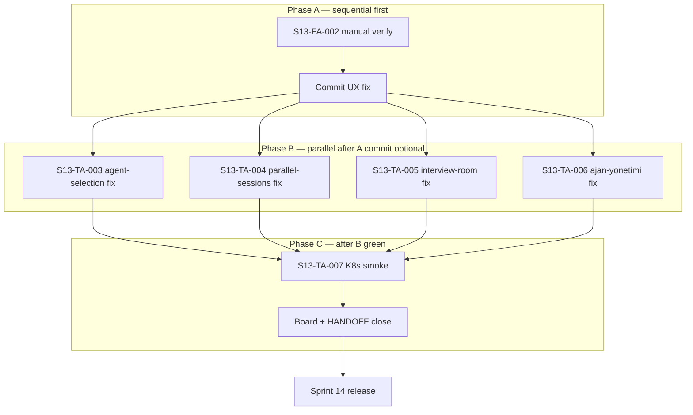

# Sprint 13 — Revised Plan (Multi-Agent UI + Manual Evaluate UX)

> **DO NOT START until this plan is approved by the user.**  
> Planning-only deliverable. No implementation, deploy, or GitHub board changes until explicit approval.

**Revised:** 2026-06-17  
**Branch:** `sprint-7/ui-and-tests`  
**Prior plan:** [multi-agent_ui_tests_f91c27c5.plan.md](file:///c:/Users/Tolga%20EVREN/.cursor/plans/multi-agent_ui_tests_f91c27c5.plan.md)  
**Release follow-on:** [sprint_14_release_155f7455.plan.md](file:///c:/Users/Tolga%20EVREN/.cursor/plans/sprint_14_release_155f7455.plan.md) — **not in S13 scope**

---

## Context

| Area | State |
|------|--------|
| **S12** | Done in code (`test_09`, QuestionManagement, lakehouse, `learning-history`, Fuseki) — **not committed** |
| **S13 original** | Playwright infra + 4 specs largely scaffolded; **local gate not green** |
| **User finding (manual test)** | Interview Room: auto-evaluate removed, manual **Değerlendir** button, stuck-state fix — **fixed in uncommitted** `InterviewRoom.tsx` + `api.ts` |
| **Board IDs** | `.sprint13_ids.json` has S13-TA-001..007 + S13-FA-001 (no S13-FA-002 yet) |
| **Cluster** | Still `sprint11` images — deploy is **Sprint 14** |

---

## Sprint 13 Goal (revised)

1. Land the **manual evaluate UX fix** (user finding) with verification and commit.
2. Finish Playwright multi-agent UI suite — **all specs green** locally (and K8s smoke config validated).
3. Close sprint: board status, HANDOFF snippet, hand off to **Sprint 14 release**.

---

## GitHub Board Tasks

| ID | Task | Agent | Board status | Notes |
|----|------|-------|--------------|-------|
| **S13-FA-002** | Manual answer evaluation UX — verify, commit, optional Playwright assertion | Frontend | **Planned** | **New.** Uncommitted fix in `InterviewRoom.tsx` + `api.ts`. Board item **TBD on approval**. |
| **S13-TA-001** | Playwright kurulum + proje iskeleti | Test | **Done** | `playwright.config.ts`, `playwright.k8s.config.ts`, `package.json` scripts, `e2e/` tree |
| **S13-TA-002** | API fixture helper + global-setup | Test | **Done** | `e2e/fixtures/api.ts`, `e2e/global-setup.ts` |
| **S13-FA-001** | `data-testid` on critical controls | Frontend | **Done** | `agent-card-*`, `agent-launch-btn`, `session-panel-*`, `ws-tab-*` |
| **S13-TA-003** | AgentSelection E2E | Test | **In Progress** | Spec exists; **launch → /sessions** test fails (timeout while "Task'lar oluşturuluyor…") |
| **S13-TA-004** | ParallelSessions E2E | Test | **In Progress** | 2/3 tests likely pass; **interview tab** fails (strict mode: duplicate "Yeni Mülakat" text) |
| **S13-TA-005** | InterviewRoom workstream tab E2E | Test | **In Progress** | Tabs render; **question load** tests fail ("Sorular yükleniyor…" stuck / selector mismatch) |
| **S13-TA-006** | AjanYonetimi metrics + document E2E | Test | **In Progress** | Sidebar + metrics likely pass; **upload** test fails (stuck "Yükleniyor…") |
| **S13-TA-007** | K8s smoke config + docs | Test | **Planned** | Config + `e2e/README.md` exist; run **after** local gate green |

**Board item IDs** (existing — from `.sprint13_ids.json`):

| Task | Item ID |
|------|---------|
| S13-TA-001 | `PVTI_lAHOAP6I-M4Bap_Hzgv9l7U` |
| S13-TA-002 | `PVTI_lAHOAP6I-M4Bap_Hzgv9l_A` |
| S13-TA-003 | `PVTI_lAHOAP6I-M4Bap_Hzgv9mCU` |
| S13-TA-004 | `PVTI_lAHOAP6I-M4Bap_Hzgv9mFo` |
| S13-TA-005 | `PVTI_lAHOAP6I-M4Bap_Hzgv9mHA` |
| S13-TA-006 | `PVTI_lAHOAP6I-M4Bap_Hzgv9mIA` |
| S13-TA-007 | `PVTI_lAHOAP6I-M4Bap_Hzgv9mI0` |
| S13-FA-001 | `PVTI_lAHOAP6I-M4Bap_Hzgv9mJY` |
| S13-FA-002 | *(create on approval)* |

---

## Phase A — UX Fix (user finding)

**Task:** S13-FA-002

### What changed (already in working tree)

| File | Change |
|------|--------|
| `services/frontend/src/pages/InterviewRoom.tsx` | Removed auto-evaluate on save; manual **Değerlendir** / **Yeniden değerlendir** button; `evaluatingId` + `evalErrors` prevent stuck UI |
| `services/frontend/src/api.ts` | `evaluateAnswer` with 90s `AbortController` timeout |

### Execution steps (when approved)

1. **Manual verify** — Interview Room: save answer → no auto LLM call; click Değerlendir → evaluation appears or clear error; no permanent spinner.
2. **Commit** — Include only S13-FA-002 files (or grouped with S13 batch per S14 plan).
3. **Optional Playwright** — If/when interview-room specs cover answer flow: assert **Değerlendir** visible, no auto-eval network call on save. Not required for Phase A gate if manual verify passes.

### Phase A gate

- [ ] Manual smoke on `/interview?assessment_id=…` passes
- [ ] `InterviewRoom.tsx` + `api.ts` committed (or staged for S14-DA-001 batch)

---

## Phase B — Playwright (original S13)

### Done vs remaining

| Component | Status |
|-----------|--------|
| Playwright deps + configs | **Done** |
| `e2e/fixtures/api.ts`, `global-setup.ts` | **Done** |
| Page objects (4 files) | **Done** |
| Spec files (4 files, ~12 tests) | **Written** |
| `e2e/README.md` | **Done** |
| Local `npm run test:e2e` all green | **Remaining** |
| K8s `npm run test:e2e:k8s` smoke | **Remaining** (S13-TA-007) |

### Known failures (from last `test-results/`)

| Spec | Test | Likely fix direction |
|------|------|----------------------|
| `agent-selection.spec.ts` | multi-select and launch creates tasks | Increase navigation wait; wait for launch button re-enable; or fix slow `createTask` API |
| `parallel-sessions.spec.ts` | interview tab loads question bank | Use `getByRole('button', { name: '+ Yeni Mülakat' })` instead of ambiguous `getByText('Yeni Mülakat')` |
| `interview-room-tabs.spec.ts` | kubernetes tab loads questions | Questions stuck loading — check interview auto-populate API path; align assertion with actual UI copy |
| `interview-room-tabs.spec.ts` | lakehouse different question set | Depends on kubernetes load fix + lakehouse seed |
| `ajan-yonetimi.spec.ts` | uploads TXT document | Wait for upload completion (spinner hidden) before filename assertion; verify Qdrant/API path |

Tests likely **already passing**: 8 workstream cards, 3 session panels grid, tab switching without errors, 8 workstream tabs visible, ajan-yonetimi sidebar + metrics.

### Execution steps (when approved)

**S13-TA-003..006** — fix specs and/or page objects (prefer test-side fixes unless product bug confirmed):

1. Run full suite with API port-forward: `npm run test:e2e`
2. Fix failures in parallel tracks (see below)
3. Re-run until **12/12 pass** (or documented skip with reason — none expected)

**S13-TA-007** — after local green:

```powershell
kubectl port-forward -n aakp-information svc/aakp-frontend 8088:8088
# API port-forward on 8000
cd services/frontend
$env:PLAYWRIGHT_BASE_URL = "http://localhost:8088"
npm run test:e2e:k8s
```

### Phase B gate

- [ ] `npm run test:e2e` — all specs pass locally
- [ ] `npm run test:e2e:k8s` — smoke pass (or documented env blocker)
- [ ] Existing pytest suite unchanged: `py -m pytest tests/ -v`

---

## Phase C — Sprint close

1. **Board** — Set S13-FA-002 + S13-TA-003..007 to **Done**; S13-FA-002 item created if not exists.
2. **HANDOFF** — Update sprint table: S13 Done, link this doc, Playwright commands (already in HANDOFF kritik komutlar).
3. **S14 handoff** — Sprint 13 completion **unblocks** Sprint 14 release (commit, PR, deploy, CI). Do **not** merge release work into S13.

### HANDOFF snippet (for Phase C)

```markdown
### Sprint 13 — Done (2026-06-17)
- Manual evaluate UX (S13-FA-002): Değerlendir button, no auto-evaluate on save
- Playwright multi-agent E2E: 4 specs under `services/frontend/e2e/`
- Plan: docs/SPRINT_13_REVISED.md
- Next: Sprint 14 release (see .cursor/plans/sprint_14_release_155f7455.plan.md)
```

---

## Parallel execution (when sprint runs)



| Phase | Parallel tracks | Notes |
|-------|-----------------|-------|
| **A** | Single track | User finding; commit before or alongside Playwright fixes |
| **B** | TA-003, TA-004, TA-005, TA-006 | Independent spec files; share API port-forward |
| **C** | TA-007 then board/HANDOFF | Sequential; triggers S14 |

**Recommended run order when user says "run sprint":**

1. Phase A — verify + commit S13-FA-002  
2. Phase B — fix four failing specs in parallel (one agent per TA-003..006)  
3. Full `npm run test:e2e` gate  
4. Phase C — K8s smoke, board Done, HANDOFF snippet  
5. **Stop** — begin Sprint 14 only after user approves release plan  

---

## Explicitly NOT in Sprint 13 (→ Sprint 14)

These stay in [Sprint 14 plan](file:///c:/Users/Tolga%20EVREN/.cursor/plans/sprint_14_release_155f7455.plan.md):

| ID | Task |
|----|------|
| S14-DA-001 | Commit S12+S13 batch to git |
| S14-DA-002 | PR → main |
| S14-DA-003 | `sprint14` image build + K8s deploy |
| S14-DA-004 | HANDOFF full update |
| S14-DA-005 | Root `frontend/` archive decision |
| S14-TA-001 | CI pytest job |
| S14-TA-002 | CI Playwright job |
| S14-TA-003 | Full release test gate |
| S14-SA-001 | Post-deploy smoke (learning-history, metrics, secret) |

---

## Success criteria (Sprint 13)

- [ ] S13-FA-002 verified and committed
- [ ] 4 Playwright spec files, ~12 tests, **all pass** locally
- [ ] K8s smoke config exercised (S13-TA-007)
- [ ] Board: all S13 tasks Done
- [ ] HANDOFF points to this doc; S14 release ready to start
- [ ] No cluster deploy in S13

---

## Risks

| Risk | Mitigation |
|------|------------|
| Interview questions never load in E2E | Check API `/interviews` + question-bank populate; may need fixture seed |
| Document upload slow (Qdrant) | Page object waits on spinner hidden, not immediate filename |
| Agent launch slow | Longer `toHaveURL` timeout + wait for button state |
| S12 uncommitted code mixed in commit | S14-DA-001 owns batching; S13 commit can be UX-only or wait for S14 |
